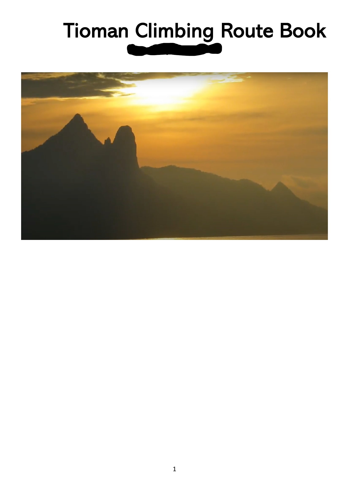
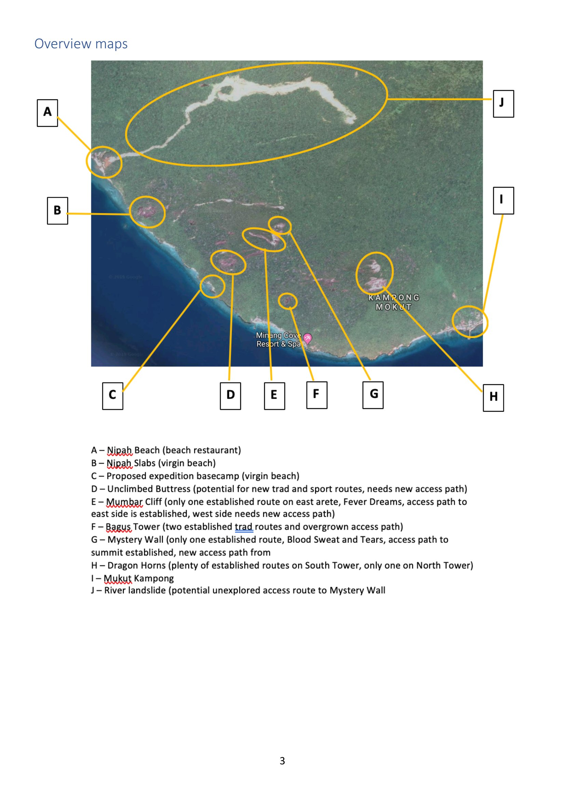

# Overview — climbing on Pulau Tioman

> Source: PDF pages 1–3 (title page, table of contents, overview map).

Pulau Tioman is a volcanic island off the south-east coast of Peninsular Malaysia, in the
state of Pahang. Its interior is steep primary rainforest studded with **granite domes and
towers** rising straight out of the jungle. The best known are **the Dragon's Horns**
(*Bukit / Gunung Nenek Semukut*), the twin fangs above the village of **Kampung Mukut** on
the south coast — a genuinely world-class big-wall objective that has drawn first-ascent
teams from the USA, France, Poland, Iran, China and Malaysia since 2000.

Despite that, there has never been a single published guidebook. Route information is
scattered across a physical logbook at Mukut, expedition reports, magazine articles, blog
posts, a few YouTube films, and word of mouth. This guidebook exists to consolidate it.

## The areas

The master map (source page 3) marks ten features along the south-west/south coast between
**Nipah** and **Mukut**:

| Key | Feature | Status |
|---|---|---|
| **A** | Nipah Beach (beach restaurant) | access point |
| **B** | Nipah Slabs (virgin beach) | undeveloped |
| **C** | Proposed expedition basecamp (virgin beach) | undeveloped |
| **D** | Unclimbed Buttress | undeveloped — "potential for new trad and sport routes, needs new access path" |
| **E** | **Mumbar Cliff** (Kota Sirau) | one established line on the arête (*Fever Dreams*); more since. East access path established, west side needs a path |
| **F** | **Bagus Tower** | two established trad routes; access path overgrown |
| **G** | **Batu Sirau** / "Mystery Wall" / "Mystery Pinnacle" | one established route (*Blood Sweat and Fear*); summit access path established |
| **H** | **The Dragon's Horns** | the main area — many routes on the South Tower, one on the North Tower |
| **I** | Kampung Mukut | the village — accommodation, boats, guides, the logbook |
| **J** | River landslide | possible unexplored access route to the Mystery Wall |

Detailed area pages:

- [Puncak Nipah](areas/puncak-nipah.md) — near **A/B**
- [Mumbar Cliff](areas/mumbar-cliff.md) — **E**
- [Batu Sirau / Mystery Pinnacle](areas/batu-sirau.md) — **G**
- [Bagus Tower](areas/bagus-tower.md) — **F**
- [The Dragon's Horns](areas/dragons-horns.md) — **H**
- [Puncak Anak (Baby Dragon)](areas/puncak-anak.md) — a smaller tower on the Nenek Semukut ridge, near **H**
- [Juara Beach](areas/juara-beach.md) — east coast, separate; undeveloped sea-cliff / bouldering

## Getting there

- **To the island:** ferry from **Mersing** or **Tanjung Gemok** (Endau) on the mainland to
  one of Tioman's west-coast villages. Small domestic flights to Tioman have operated
  intermittently.
- **To Mukut (for the Dragon's Horns, Nenek Semukut, Puncak Anak):** Mukut is on the south
  coast with no road connection. Reach it by **sea taxi / charter boat** from Genting or
  Nipah, or by the coastal trail. Several trip reports mention borrowing **kayaks from
  Juara** to paddle round to Mukut.
- **To Mumbar / Bagus / Batu Sirau:** from the **Nipah** side, via the Nipah→Tunamaya
  coastal concrete path and then jungle trails — see the Mumbar page for the full
  description. Boat drop-offs at Tunamaya jetty or the beaches below shorten the walk.
- Accommodation and logistics at Mukut have historically run through **"Uncle Sam"** and
  **Tam Haja** (Tam Khairudin Haja — compiler of the route book and a first-ascentionist on
  several routes) and the **Simukut Hillview** lodge. Nearly every trip report thanks them.
- **Emergency / local contact: Tam Haja — +60 12-919 0785, khairudinhaja@gmail.com.** These
  walls are remote and above a road-less village; leave a plan and expected return time, and
  see the site's emergency & rescue page.

## Access checkpoints ("CP")

The Nenek Semukut hiking trail from Mukut is marked with numbered checkpoints (**CP4, CP5,
CP7, CP9 …**). Route approaches are almost always described relative to these:

- **CP5** — branch point for Batu Naga and Damai Sentosa (South Tower, south/south-west side).
- **CP7** — branch point (turn left / uphill) for Polish Princess, Sam Sam, Naga, Freebird,
  Puncak Anak.
- **CP9** — on the far side of the peak; the Naga line is visible from here.
- **CP4 / CP5** — a base camp with water is on the trail near here (used for the multi-day
  "Dragon Tour" traverse).

## When to go

Trip reports cluster in **March–April** and again around **August** (Malaysian *Merdeka*
holiday). Climbers describe racing to finish crux pitches "before the sun hits" and being
"on the shade before 1 pm in late April" — south and south-west faces bake in the afternoon.
Rain is the bigger constraint: the *Fever Dreams* notes say the first pitch needs **at least
two days of no rain to dry**. The north-east monsoon (roughly **November–February**) brings
heavy rain and rough seas to the east coast and can close ferry services.

## Style & ethics (from the trip reports)

- Most Dragon's Horns routes are **serious**: long runouts, some loose rock, mixed
  bolted / natural / aid protection, jungle pitches to the summit, and long committing
  abseil descents (frequently done in the dark).
- **Anchors are being re-equipped over time.** Reports mention titanium and stainless glue-ins
  being added to *Damai Sentosa*, *Polish Princess* and others by later parties (e.g. David
  Acott). Older routes may still have "one bolt + old nut tied together with tat".
- Bolting on new lines has been **mixed-style** — bolt the blank face climbing, leave cracks
  and trees for natural gear. The Malaysian teams (*Naga*, *Freebird Direct*) follow this.
- **Loose rock has put climbers in hospital** (see the *Polish Princess* report on page 63).
  Helmets, careful rope management on abseil, and route cleaning are recurring themes.
- Respect Mukut village, the trail checkpoints, and the people who maintain them.

## Media

- **"Scaling Dragons" — Naga, Tioman Island** (YouTube): featured on source page 64 —
  `https://www.youtube.com/watch?v=XxuZRrAhgZI` (part of a playlist).
- David Kaszlikowski / **Vertical Vision** photography of the Horns, Mumbar and Batu Sirau.
- Cedar Wright & Lucho Rivera's 2011 first ascents of **Batu Naga** and **Tanoshi Buttress**
  were written up by *Alpinist*.
