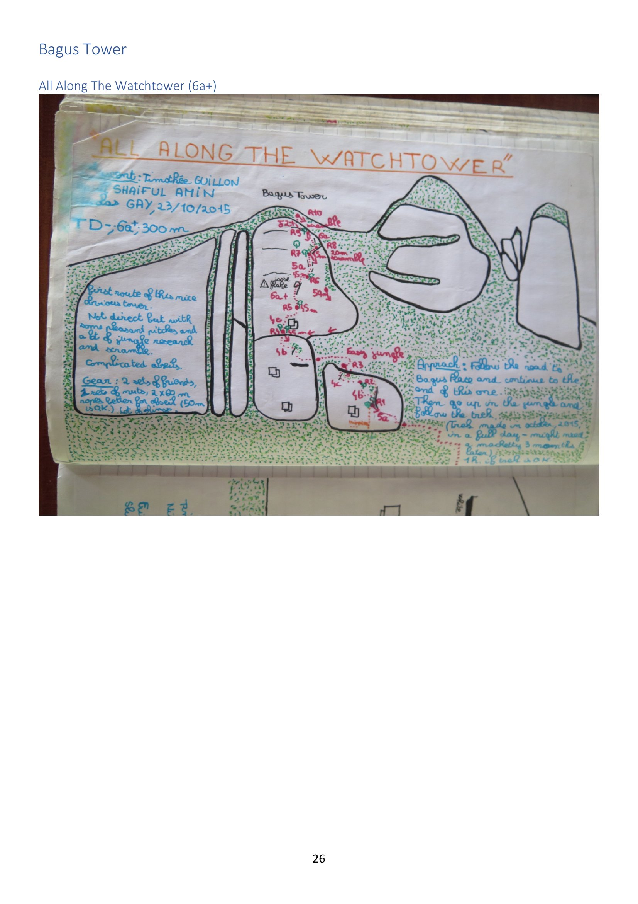
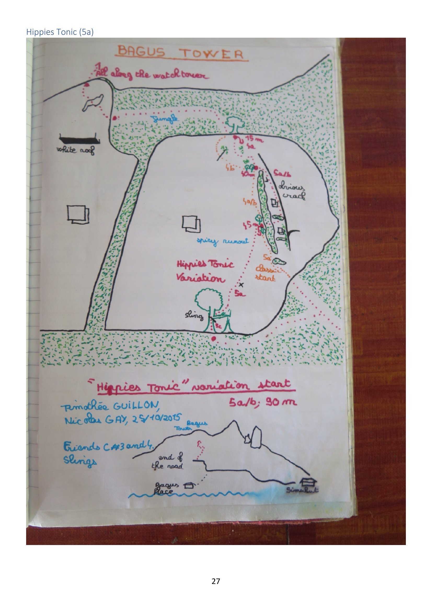

# Bagus Tower

> Source: PDF pages 26–27.

A *"nice obvious tower"* — feature **F** on the [overview map](../00-overview.md):
*"two established trad routes and overgrown access path."* Both routes and both topos come
from the **Guillon / Gay / Amin** party, October 2015, and survive only as photographed
logbook pages.

---

## Approach

> From the "All Along the Watchtower" logbook page (source page 26):

Follow the **road to Bagus Place** and continue to **the end of it**. Then head **up into
the jungle and follow the trek**. The trail was cut in **October 2015 in a full day** —
*"might need a machete 3 months later."* About **1 h of trekking** once on trail.

The mini-map on the *Hippies Tonic* page (source page 27) shows: **Bagus Place** → end of the
road → **Bagus Tower**, with **Simukut** off to the right.

---

## Routes

| Route | Grade | Length | FA | Date |
|---|---|---|---|---|
| [All Along the Watchtower](#all-along-the-watchtower) | 6a+ (TD−) | 300 m, ~10 pitches | Timothée Guillon, Shaiful Amin, Nicolas Gay | 23 Oct 2015 |
| [Hippies Tonic (variation start)](#hippies-tonic) | 5a/b | 90 m | Timothée Guillon, Nicolas Gay | 25 Oct 2015 |

---

### All Along the Watchtower

| | |
|---|---|
| **Grade** | 6a+, **TD−** |
| **Length** | 300 m (~10 pitches to R10 + a 10 m scramble) |
| **First ascent** | Timothée Guillon, Shaiful Amin, Nicolas Gay — **23 October 2015** |
| **Gear** | 2 sets of Friends, 1 set of nuts, **2 × 60 m ropes** (better for the abseil; 50 m is OK) |

*"First route of this nice obvious tower. Not direct but with some pleasant pitches and a
lot of jungle research and scramble. Complicated abseil."*

Pitch grades on the hand-drawn topo run roughly **4b / 4c / 5a / 6a+ / 5a / 5a / 6a** with a
*"loose flake"* warning and a `10 m scramble` to finish. The topo also sketches the whole
Bagus Tower massif with the neighbouring formations.

---

### Hippies Tonic

Recorded only as a **variation start** to the tower.

| | |
|---|---|
| **Grade** | 5a/b |
| **Length** | 90 m |
| **First ascent** | Timothée Guillon, Nicolas Gay — **25 October 2015** |
| **Gear** | Friends C#3 and C#4, slings |

The topo (source page 27) shows an **"obvious crack"** (5a/b), a **"classic start"** (5a), a
section marked **"spicy runout"**, and a tree with a sling. It joins the main tower routes
higher up.

