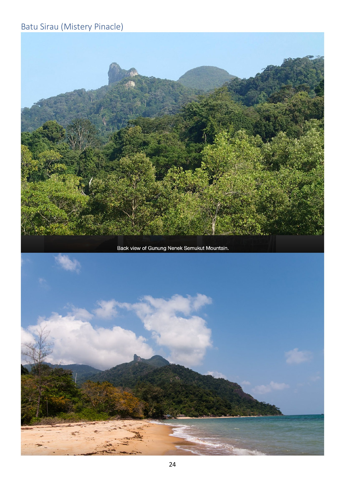
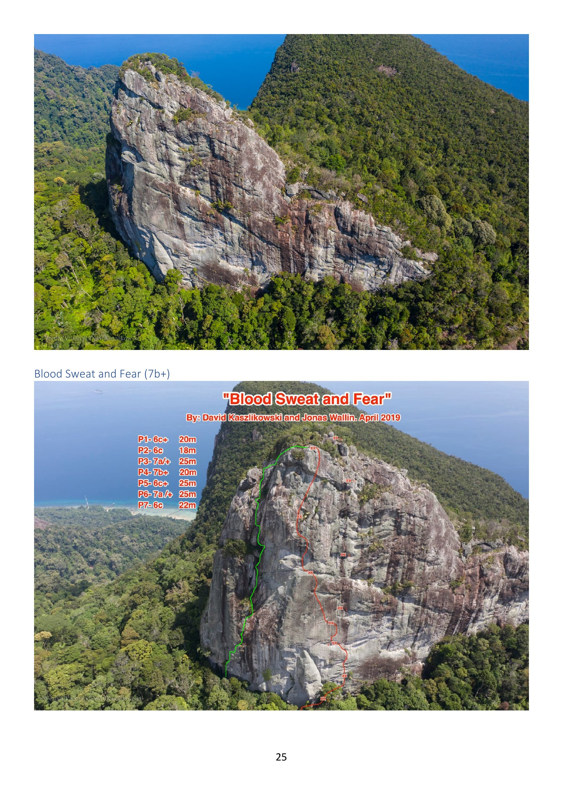

# Batu Sirau / "Mystery Pinnacle" / "Mystery Wall"

> Source: PDF pages 24–25.

A steep **granite pinnacle on the back (north/north-west) side of Gunung Nenek Semukut** —
feature **G** on the [overview map](../00-overview.md), where it is labelled *"Mystery Wall …
only one established route … access path to summit established, new access path from [the]
river landslide"* (feature **J**).

> [!NOTE]
> **Naming is tangled in the source.** The section is titled *"Batu Sirau (Mistery
> Pinacle)"*; the overview map says *"Mystery Wall"*; the route photo says *"Blood Sweat
> and Fear"* while the overview map says *"Blood Sweat and Tears"*. Separately, *"Batu Naga"*
> is a different route, on the **South Tower of the Dragon's Horns** (see
> [dragons-horns.md](dragons-horns.md)), and *"Kota Sirau"* is used for
> [Mumbar Cliff](mumbar-cliff.md). These need to be disambiguated on the ground before
> publishing.

---

## Blood Sweat and Fear

| | |
|---|---|
| **Grade** | 7b+ (contents) / hardest pitch **7b+** (topo) |
| **Length** | ~7 pitches, ~153 m of climbing (sum of pitch lengths below) |
| **First ascent** | **David Kaszlikowski & Jonas Wallin, April 2019** |
| **Style** | Steep, compact granite pinnacle. Aerial photos by Vertical Vision / David Kaszlikowski |

**Pitch list (from the photo topo, source page 25):**

| P | Grade | Length |
|---|---|---|
| 1 | 6c+ | 20 m |
| 2 | 6c | 18 m |
| 3 | 7a/+ | 25 m |
| 4 | 7b+ | 20 m |
| 5 | 6c+ | 25 m |
| 6 | 7a/+ | 25 m |
| 7 | 6c | 22 m |

The topo shows the **red route line** and a separate **green line** (a descent or a second
partial line) on the left side of the formation. Belay stations are marked `xx`.

---

## Access & potential

- The **summit access path is established** (per the overview map).
- A **new approach from the "river landslide"** (feature **J**) is noted as
  *"potential unexplored access route to Mystery Wall"* — worth investigating.
- The overview map also marks feature **D**, an **"Unclimbed Buttress"** nearby with
  *"potential for new trad and sport routes"* but no access path yet.
