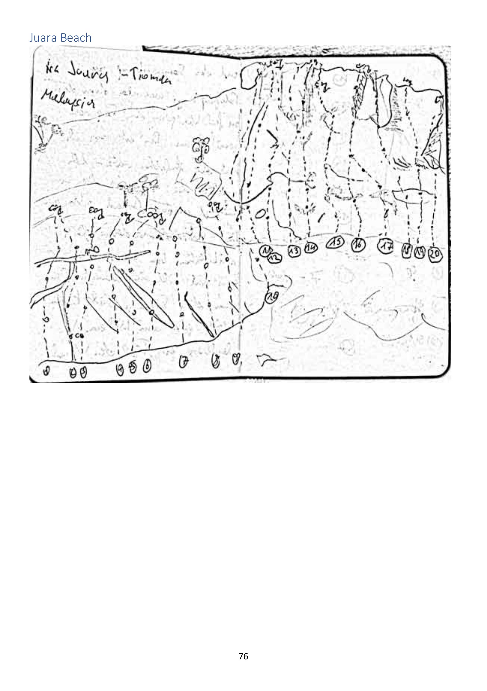

# Juara Beach

> Source: PDF page 76.

**Juara** is on the **east coast** of Tioman — the quiet side, separate from all the other
areas in this book. The last page of the route book is a **rough field sketch** from a
notebook, captioned *"nr Juara — Tioman Malaysia"*.

## Status: undeveloped / undocumented

The sketch shows a **sea-cliff and boulder area** with roughly **20 numbered lines or
problems** drawn on it. There are **no names, no grades, and no description** — it is a
"there is rock here, someone should look at it" note, not a topo.

Likely potential:

- **Bouldering** on the beach boulders.
- **Deep-water soloing** on the sea cliffs (unconfirmed — depth and tide not noted).
- Short single-pitch sport / trad lines.

Anyone with first-hand knowledge of Juara climbing should treat this page as an invitation
to survey and document the area properly.

- **Access:** Juara is reached by the cross-island road/trail from Tekek, or by boat.
  **Little Planet** (a Juara guesthouse) is mentioned elsewhere in the book as lending
  **kayaks** to climbers heading round to Mukut.

