# Mumbar Cliff (Kota Sirau)

> Source: PDF pages 6–23.

**Mumbar Cliff** — also written **Kota Sirau** — is feature **E** on the
[overview map](../00-overview.md): a big granite face on the flank of **Batu Mumbar**,
inland from the Nipah→Tunamaya coast. An **arête splits the face into two sectors**:

- **left** — lower-angle black / brown slabs, *"great clean rock"*;
- **right** — a steeper wall with a white stripe of *"steep granite … one of the steepest
  routes in the massif."*

David Kaszlikowski, who put up the first route here in 2016, called Mumbar *"my fourth route
in the massif"* and predicted the Dragon's Horns area *"slowly turns into a regular world
climbing destination."*

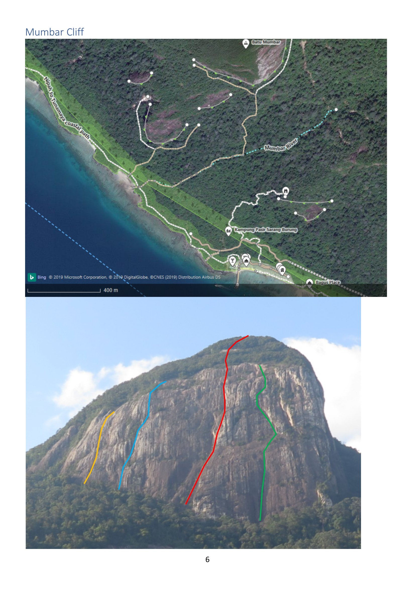

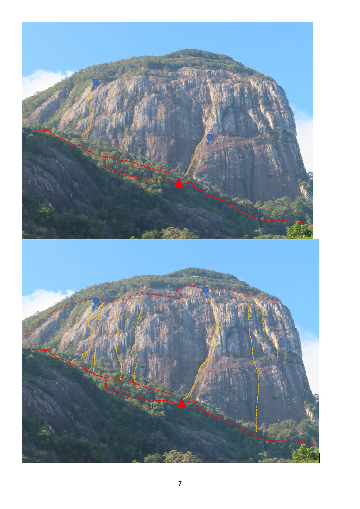

---

## Approach

> Transcribed from the handwritten "Mumbar Approach Trail" logbook page (source page 8),
> plus the Kaszlikowski/Wallin expedition notes (source page 9).

**On foot from the Nipah side — max ~2h 20m (≈5 km) from the Uncle Sam bungalow:**

1. Follow the **concrete path** up to **Minang Cove**, then descend to the resorts.
2. Follow the **beach** to **Tunamaya jetty** (the last resort).
3. Climb back up to the concrete path (~50 m above the Tunamaya service bungalows) and
   follow it to **where the concrete ends**.
4. Follow the **electric-cable path** down to the beach.
5. Enter the **dry riverbed** and follow **cairns** for **20–30 min** until you see
   **yellow stripes painted on the trees** — this is where the jungle path starts.
6. A **marked jungle trail** (cut in **April 2016**) then takes **another 30–40 min** to
   reach the wall.

**By boat:** land at **Tunamaya**, or continue to the beach (*"2nd beach on the left from
Tunamaya jetty"*) — then **~1.2 h** on foot to the wall.

The 2016 expedition first reached the mountain **in 3 hours** (27 March 2016) with a large
support team, then **spent two days finding the start of the climbing** above the tree line.
Transport problems meant *"many days walking up/down (10 km) which finished with cramps,
fever and dehydration"* — hence the route name.

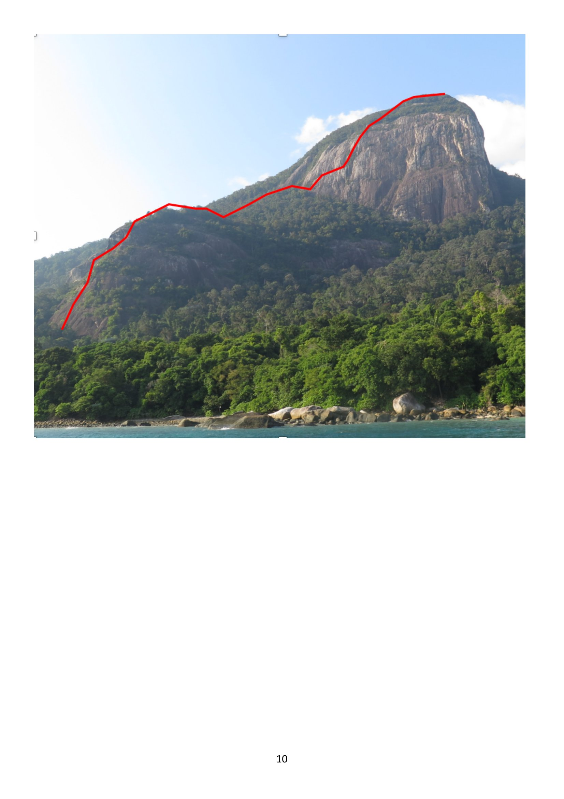

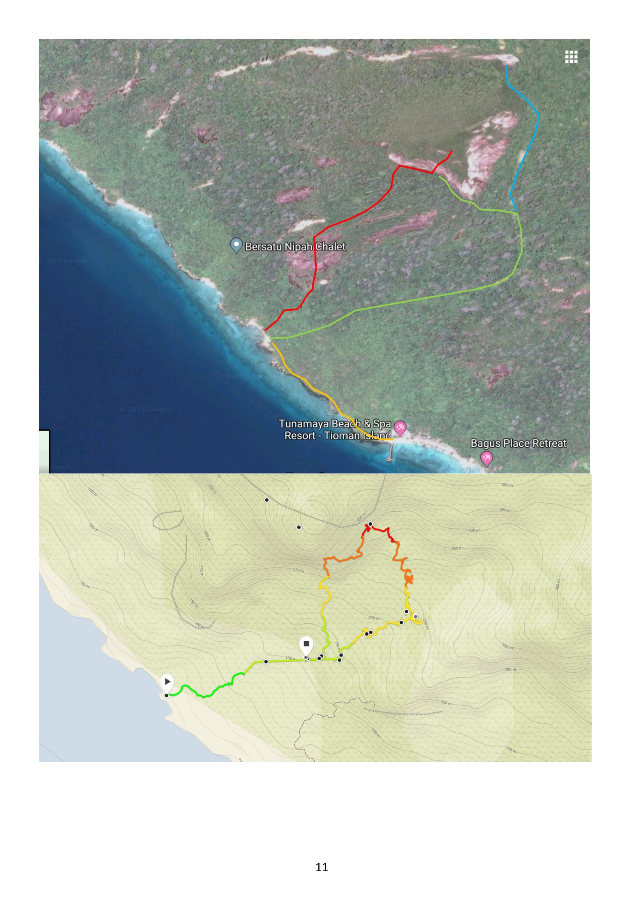

---

## Routes

| Route | Grade | Length | FA | Year | Notes |
|---|---|---|---|---|---|
| [Fever Dreams](#fever-dreams) | **7c** (7c max) | ~250 m, 9 pitches | Jonas Wallin, David Kaszlikowski | Apr 2016 | First route on the cliff. Steep right-hand pillar. Top 6 pitches fully bolted |
| [Yoga Boy](#yoga-boy) | **HVS 5a** | 220 m, 5 pitches | Michael Söldner, Tam Khairudin Haja, "Stuart [?]" | Jul 2019 | First route on the **south face**. Left-hand lower-angle sector |
| [Project Grand Central](#project-grand-central) | **E1 5a** (so far) | ~400 m, 8 pitches | Michael Söldner, Kai Voges | Jul 2019 | **First 4 pitches only** established; upper pitches a project |

---

### Fever Dreams

*"First climb opened on the Mumbar mountain."* One of the steepest lines in the whole massif.

| | |
|---|---|
| **Grade** | 7c max (pitch grades on the photo topo: 6a+, 7a+, 6c, 7b, 6c, 7c, 6b+, 6a+) |
| **Length** | ~240–250 m, **9 pitches** |
| **First ascent** | Jonas Wallin & David Kaszlikowski, **16 April 2016** (route opened 27 Mar – 16 Apr 2016) |
| **Gear** | Single rack to BD #3, **16 quickdraws**. After pitch 3, **no cams needed — all bolted** |
| **Conditions** | Pitch 1 is *"probably ~6c if it's dry… at least 2 days of no rain needed"* |
| **Descent** | Abseil the line. From **pitch 5 up**, all pitches can be climbed and rappelled on a **single 60 m rope**. Back-clip on some pitches *"otherwise you finish hanging in the air"*. Extra abseil anchor at the top of pitch 3 |
| **Thanks** | Nikki, Eliza, Tam, Farook, Serina, Uncle Sam *"and the volunteers"* |

**Character (from the notes):** three "approach" pitches lead to a **steep pillar of clean
granite**; the **top six pitches are fully bolted**.

**Pitch list — from the hand-drawn topo (source page 22), approximate:**

| P | Grade | Length |
|---|---|---|
| 1 | 6c | ~18 m |
| 2 | 6a/+ | ~25 m |
| 3 | 6b | ~28 m |
| 4 | 7c | ~40 m |
| — | (7b+/c variation — *"take long quickdraws"*) | |
| 5 | 6c | ~25 m |
| 6 | 7b | ~30 m |
| 7 | 6c | ~20 m |
| 8 | 7a/+ | ~20 m |
| 9 | 6a | ~30 m |

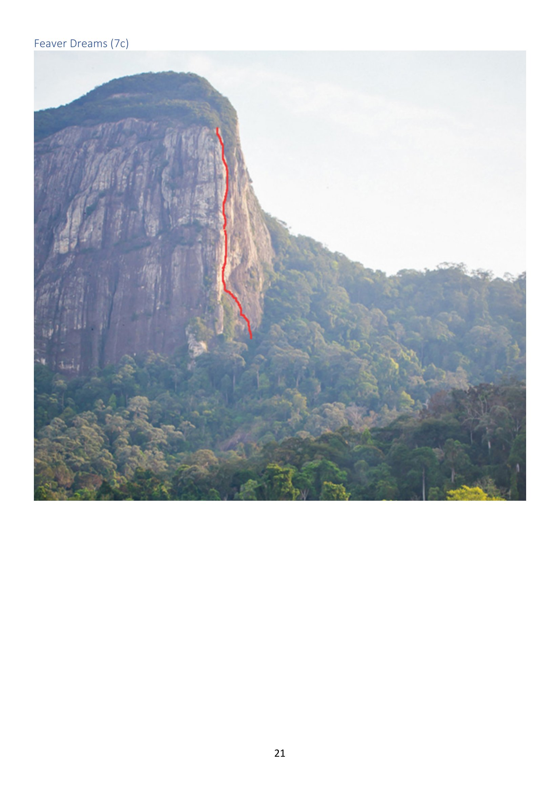

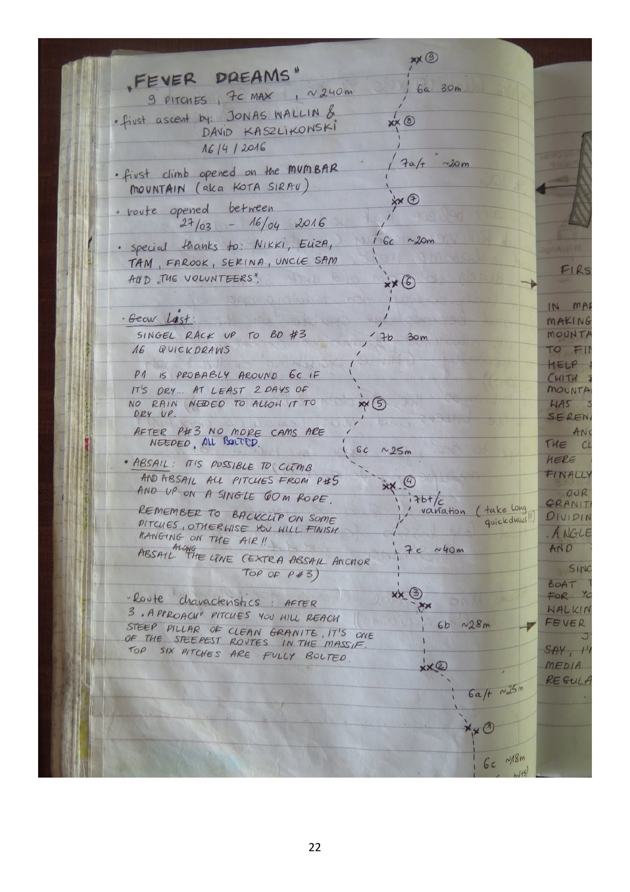

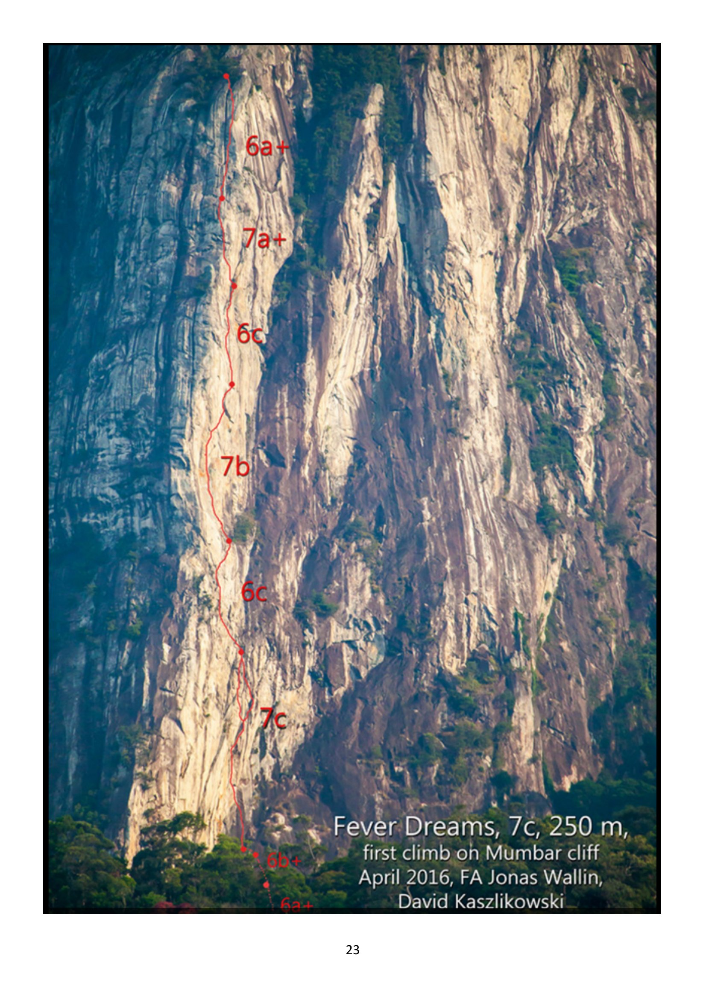

---

### Yoga Boy

*"First climb on Mumbar south face."*

| | |
|---|---|
| **Grade** | HVS 5a (pitch grades on topo: 5a, 4c, 4c, 4c, 4c) |
| **Length** | 220 m, **5 pitches** (R1–R5) |
| **First ascent** | Michael Söldner, Tam Khairudin Haja, "Stuart [?]" — **July 2019** |
| **Sector** | Left-hand, lower-angle black/brown slab sector |

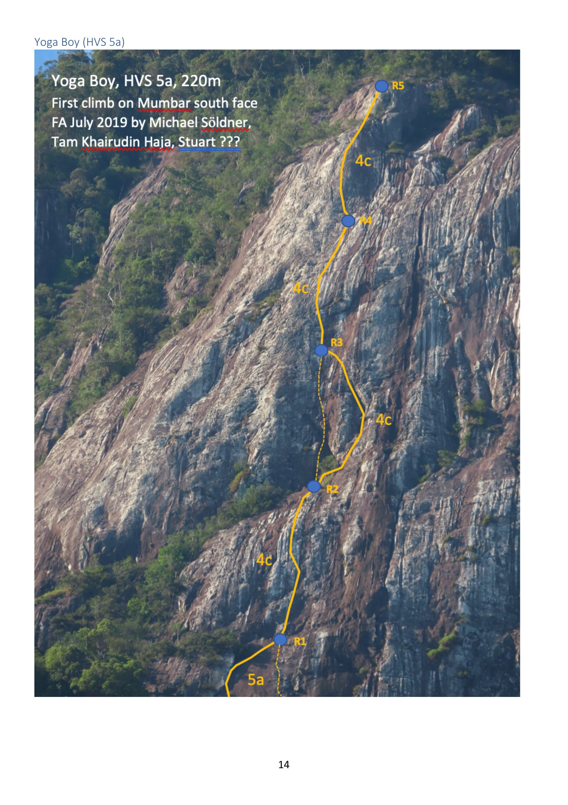

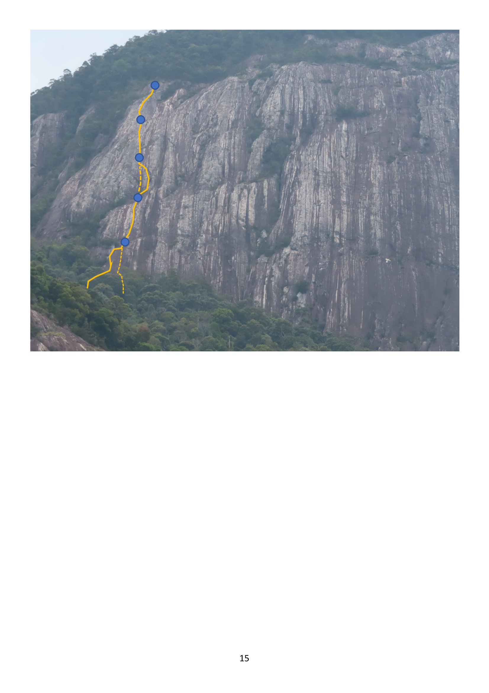

---

### Project Grand Central

An intended **~400 m** line up the full face. As of the source, **only the first four pitches
are climbed** (all ~5a); the rest is drawn as a dashed project line to an eighth belay.

| | |
|---|---|
| **Grade** | E1 5a for the established section (*"E1 5a?"* in the contents) |
| **Length** | ~400 m planned, 8 belays; **first 4 pitches established** |
| **First ascent (lower pitches)** | Michael Söldner & Kai Voges — **July 2019** |

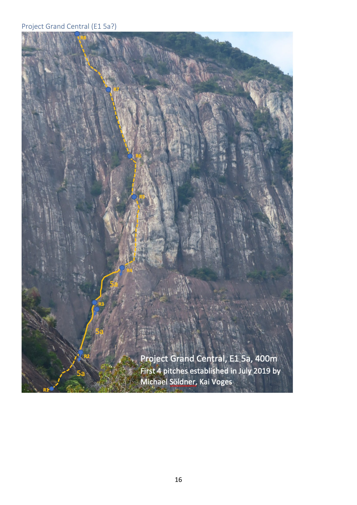

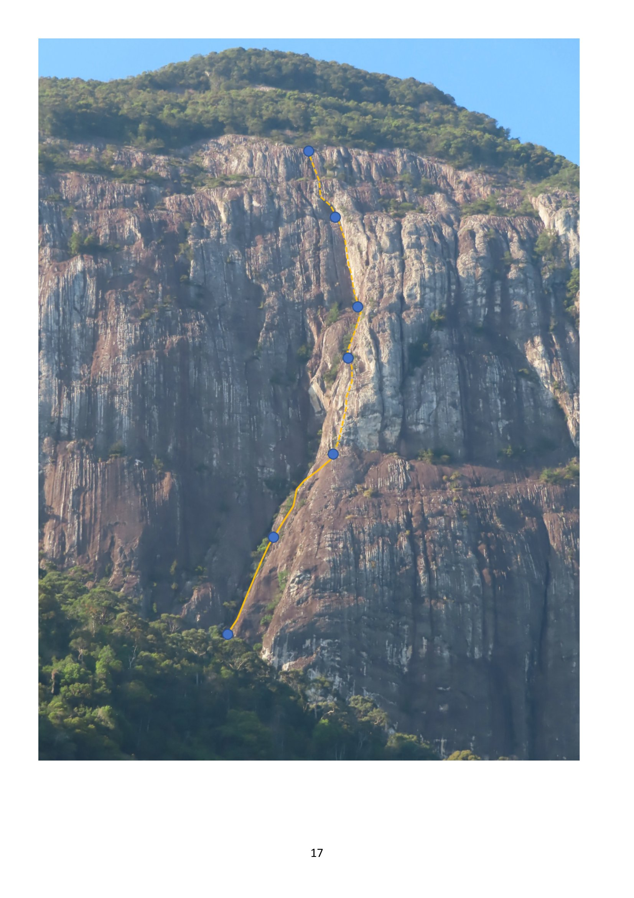

---

## The expedition write-up (verbatim-ish)

> From the handwritten page headed **"EXPEDITION MUMBAR (aka Kota Sirau) — Jonas Wallin &
> David Kaszlikowski"** (source page 9):
>
> *"First ascent on the wall, first trail up the mountain — 'Fever Dreams' route. In
> March/April 2016 we spent 3 quite exhausting weeks making another vertical vision come
> true. Since the mountain Mumbar was never climbed before, we needed to find and cut the
> approach trail first. Luckily, with help from Uncle Sam and his team, and after some
> planning (with … aerial photos in use) we managed to reach the mountain just in 3 hours
> (27.03.2016). … Another important step was to find the start of the climbing route, which
> is typically a daunting task here in the jungles of Tioman. We spent 2 days before finally
> managing to emerge above the tree line. Our climb was above us — a white stripe of steep
> granite, located just in the right from the arête dividing the mountain into 2 sectors:
> left with lower-angle black/brown slabs (great clean rock there) and steeper right wall.
> … It is my fourth route in the massif, and I have to say I'm glad that because of the
> quality of climbs and after media publications, Dragon Horns slowly turns into a regular
> 'world' climbing destination."*

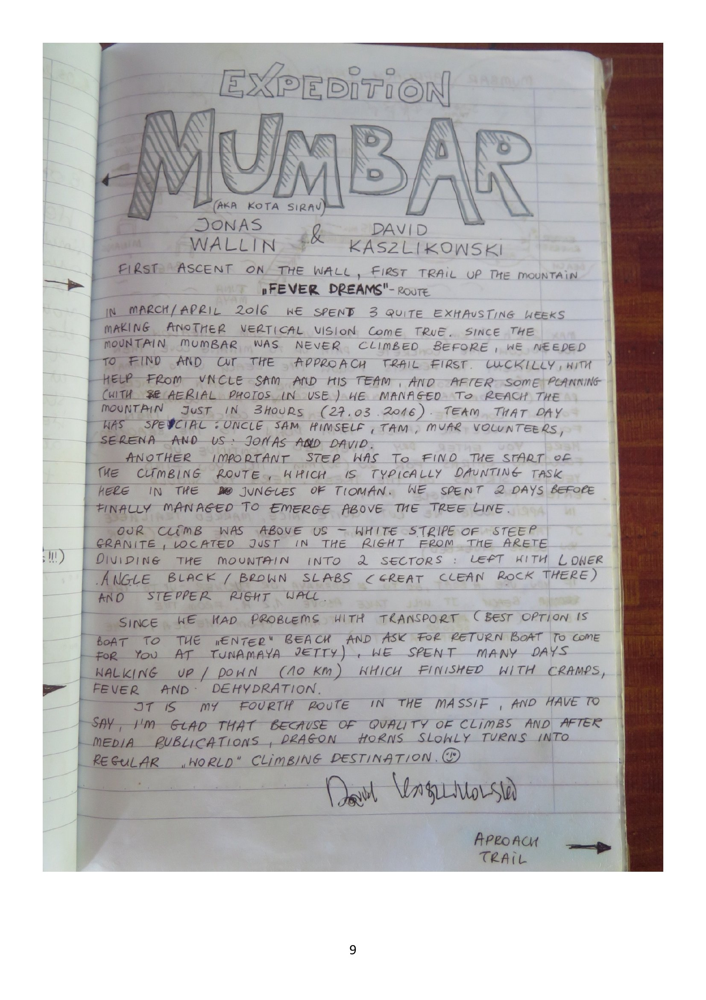
