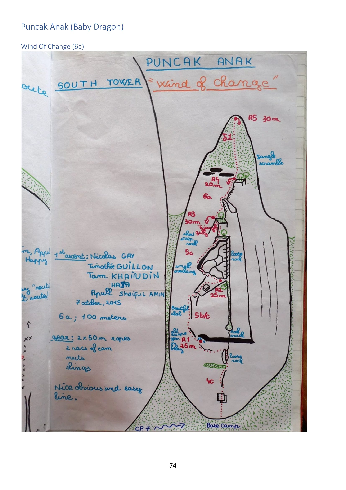

# Puncak Anak ("Baby Dragon")

> Source: PDF page 74.

A smaller tower on the **Nenek Semukut** ridge, near the Dragon's Horns and reached from the
same **CP7** branch of the Mukut hiking trail. Referred to as the **"Baby Dragon"**. Its
"South Tower" holds one recorded route.

---

## Wind of Change

| | |
|---|---|
| **Grade** | 6a |
| **Length** | 100 m, 5 belays (R1–R5) |
| **First ascent** | **7 October 2015** — Nicolas Gay, Timothée Guillon, Tam Khairudin Haja, Apull Shaiful Amin |
| **Gear** | **2 × 50 m ropes**, 2 racks of cams, nuts, slings |
| **Character** | *"Nice obvious and easy line."* |

**Pitch list (from the hand-drawn topo, source page 74):**

| P | Grade | Length | Notes |
|---|---|---|---|
| 1 | 5b/c | 25 m | *"Beautiful slab."* Old escape gully / roof crack to the left. R1 at 25 m |
| 2 | 5c | 25 m | Short steep wall + small overhang |
| 3 | 6a | 30 m | *"Short gully"* |
| 4 | 6a | 20 m | Loose-rock warning nearby |
| 5 | — | 30 m | Jungle scramble to finish |

**Base camp:** near **CP7** (shared with the Freebird / Polish Princess approaches).

