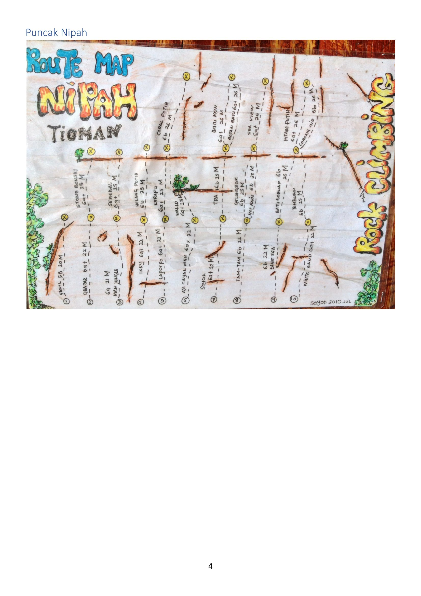
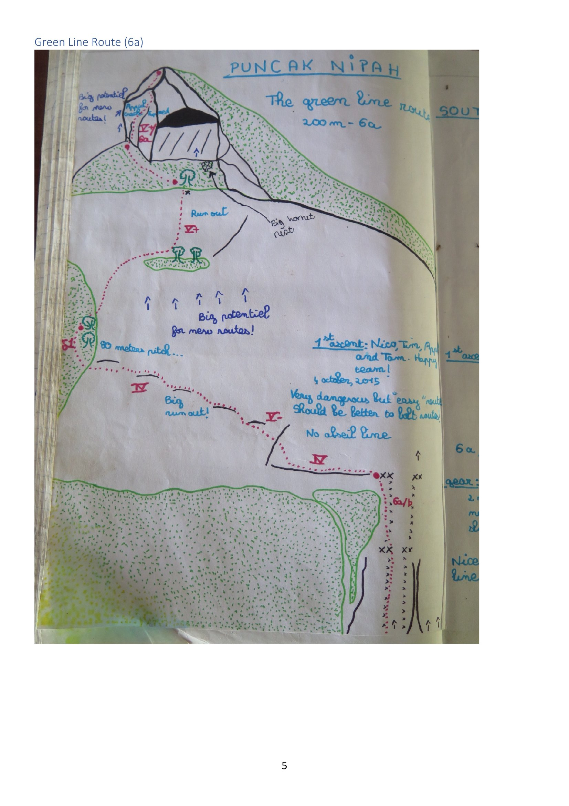

# Puncak Nipah

> Source: PDF pages 4–5.

A small peak above the **Nipah** side of the island (features **A/B** on the
[overview map](../00-overview.md)). It has two very different things to offer:

- a **single-pitch sport crag** documented only by a hand-painted "Route Map" board, and
- **the Green Line Route**, a 200 m adventure multipitch on the summit tower.

The area notes stress **"big potential for new routes"** repeatedly.

---

## Single-pitch sport crag ("Route Map Nipah")

The only record is a weathered painted board photographed for the book (signed **"Soyot,
2010 Jul"**). It shows roughly **25 bolted single-pitch lines**, mostly **grade 5b–6b**,
**20–26 m** long, spread along a wall and reached by a levelled path.

> [!NOTE]
> The board is hand-lettered and weather-worn. The list below is a best-effort reading;
> spellings and a few grades are uncertain. Treat as a starting point to be re-surveyed
> on the ground.

| # | Name (approx.) | Grade | Length |
|---|---|---|---|
| 1 | Fadil | 5b | 20 m |
| 2 | Ghapar | 6a | 22 m |
| 3 | "Map Jungle" | 6a | 21 m |
| 4 | Ikky | 6a | 22 m |
| 5 | Laporo [?] | 6a | 22 m |
| 6 | Aji Cayat Man [?] | 6a | 22 m |
| 7 | Sayok | 6a | 22 m |
| 8 | Tam-Tam | 6b | 21 m |
| 9 | "Blue Sea" | 6b | 22 m |
| — | Stone Bonsai | 6a | 25 m |
| — | Semebal | 6a | 25 m |
| — | Helang Putih | 6b | 25 m |
| — | Kirapu | 6a | 25 m |
| — | Walid | 6a | 25 m |
| — | Tita | 6b | 25 m |
| — | Gelangsok | 6b | 25 m |
| — | Nol Rain [?] | 6b | 26 m |
| — | Batu Merbnap [?] | 6b | 25 m |
| — | Tembuan | 6b | 25 m |
| — | White Sand | 6a | 21 m |
| — | Coral Putih | 6b | 26 m |
| — | Batu Men | 6a | 26 m |
| — | Rotan Batu | 6a | 26 m |
| — | Sea View | 6a | 26 m |
| — | Hitam Putih | 6a | 26 m |
| — | Lorong Air | 6b | 26 m |

---

## Green Line Route

| | |
|---|---|
| **Grade** | 6a (6a/b at the crux, per the topo) |
| **Length** | ~200 m |
| **Style** | Multipitch trad / adventure. *"Very dangerous but easy"* |
| **First ascent** | Nico, Tim, "Appol"[?] and Tom — *"Happy team"* — **4 October 2015** |
| **Protection** | Natural. **No fixed gear, no abseil line.** *"Should be better to bolt route."* |

### Description (from the topo)

The line climbs the **summit tower of Puncak Nipah** from the jungle on its south side.
Reading the topo bottom to top:

- Start from a bolted-looking anchor pair at the base (marked `6a/b`, then `xx`).
- An **~80 m pitch** ("80 meters pitch…") up easier ground with a **big runout** to a
  tree belay (marked `V-` / `IV`).
- Continue past tree belays; grades around **IV–V+**, one section marked **"Run out"** and a
  **"Big hornet nest"** noted beside the trees.
- The final headwall pitch (marked `V+` / `Vish 5a`) reaches the top. The topo notes
  *"Angel [?] roof"* and *"Big potential for new routes!"* on the summit block.

### Notes

- **No abseil line** — descent is by down-climbing / walking off (not described in detail).
- The route is repeatedly flagged as **dangerous but low-angle**: the difficulty is
  runouts and looseness, not hard moves.
- Two separate arrows on the topo point at unclimbed rock labelled **"Big potential for new
  routes!"**
